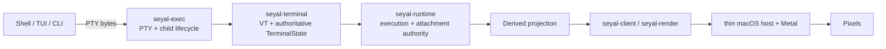

# Seyal

Seyal is an open-source, commercial, enterprise-grade, agent-native terminal workspace for software development and operations.

It is being built as a real terminal first: Seyal owns its PTY/VT/state/rendering path, treats Blocks as a native presentation primitive, and keeps agents additive rather than placing AI in the terminal hot path.

> **Status:** pre-release and under active development. The M001 foundation milestone is complete; later milestones are still evolving. Expect breaking changes before the first stable release.
>
> **Current platform focus:** macOS headed application. Linux is used for portable-core CI where applicable; no Linux/Windows headed-UI support claim is made yet. See the [compatibility policy](docs/engineering/COMPATIBILITY.md).

## Why Seyal

Seyal is designed around a few durable ideas:

- **Own the terminal stack** — real PTYs, Seyal-owned VT/state, Unicode/grapheme semantics, scrollback/history and damage tracking.
- **Native Blocks** — structured command/output presentation without creating another PTY or terminal engine.
- **Persistent execution** — GUI lifetime is separate from Runtime/PTY lifetime; detach is not terminate.
- **Agent-native, not agent-dependent** — shells and terminal rendering continue independently of agents, cloud services and semantic processing.
- **Performance by architecture** — bounded queues, minimal copies/allocations/locks and GPU rendering from the start.
- **Rust product authority, thin native host** — portable product/UI behavior in Rust; macOS-specific AppKit/Metal integration stays narrow.

## Architecture at a glance



The diagram is an orientation view only. The accepted architecture and ADRs are normative.

## Build from source

Canonical repository commands:

```sh
make bootstrap
make build
make test
make check
make bench
```

On macOS, the current headed app requires full Xcode in addition to the repository-pinned Rust toolchain. After `make build`, the development app can be launched with:

```sh
open target/macos-derived-data/Build/Products/Debug/Seyal.app
```

See [`docs/engineering/DEVELOPMENT.md`](docs/engineering/DEVELOPMENT.md) for prerequisites, clean-checkout workflow and platform-specific details.

## Start reading

If you are new to the codebase, use this order:

1. [`docs/architecture/c4/README.md`](docs/architecture/c4/README.md) — visual orientation: system context, containers, components and execution flows.
2. [`docs/architecture/README.md`](docs/architecture/README.md) — normative architecture, rationale and ADR index.
3. [`docs/specs/README.md`](docs/specs/README.md) — bounded observable/enforceable behavioral contracts.
4. [`docs/engineering/REPOSITORY-STRUCTURE.md`](docs/engineering/REPOSITORY-STRUCTURE.md) — current crates, native host and dependency direction.
5. [`docs/engineering/TESTING.md`](docs/engineering/TESTING.md) — TDD, conformance, fuzz, integration and UI testing expectations.
6. [`CONTRIBUTING.md`](CONTRIBUTING.md) — contribution workflow.

For the current milestone product slice, see [`PRODUCT.md`](PRODUCT.md). For milestone direction, see [`docs/product/ROADMAP.md`](docs/product/ROADMAP.md). The public repository owns the generic terminal foundation; commercial Pro, Teams, Enterprise, hosted-service, billing, identity, and private-deployment capabilities belong in the separate commercial composition repository and must not become dependencies here.

## Documentation authority

```text
Product & Engineering Constitution
→ accepted architecture / ADR
→ specification
→ milestone
→ Ready Issue
→ tests / implementation / evidence
```

- **ADR:** significant architectural decision, rationale, alternatives and invariants.
- **Specification:** narrower observable/enforceable behavioral contract derived from one or more accepted architectural decisions.
- **C4:** orientation only; it never creates architecture by itself.

Keep one canonical document for one purpose. Do not create competing `-v2`, `-final`, `-new`, `-amendment` or duplicate PRD/spec copies when the owning document can be updated.

## Contributing and project policy

Before contributing, read:

- [Contributing](CONTRIBUTING.md)
- [Governance](GOVERNANCE.md)
- [Support](SUPPORT.md)
- [Code of Conduct](CODE_OF_CONDUCT.md)
- [Security Policy](SECURITY.md)
- [Compatibility policy](docs/engineering/COMPATIBILITY.md)
- [Release/versioning policy](docs/engineering/RELEASES.md)

## License

Seyal OSS is licensed under the [Apache License 2.0](LICENSE).
