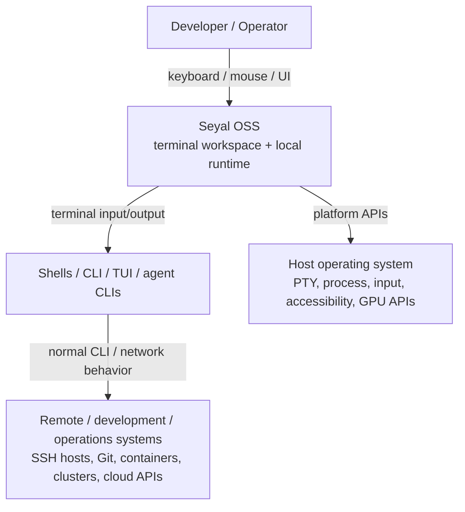

# C4 Level 1 — System Context

## Purpose

Show where **Seyal OSS** sits in a developer/operations workflow without exposing internal implementation detail.

## People

### Developer / operator

Uses Seyal to run shells, command-line tools, TUIs, coding-agent CLIs and operational workflows.

### Contributor / maintainer

Builds and evolves the OSS terminal/runtime while following accepted architecture, specifications and evidence gates.

## External systems

### Shells and terminal applications

Examples include zsh/bash/fish, SSH, Vim/Neovim, tmux, htop, developer/ops CLIs and coding-agent CLIs.

They interact with Seyal through ordinary terminal semantics. They do not receive direct access to Seyal's canonical terminal state.

### Host operating system

Provides PTY/process facilities and platform APIs. On macOS, the thin native host uses AppKit/Metal and platform input/accessibility APIs while portable product/runtime authority remains in Rust according to accepted architecture.

### Remote systems

Remote hosts, clusters, source-control systems and cloud services are normally reached by the child CLI/application being run. They are not synchronous dependencies of Seyal's terminal I/O/render hot path.

## System boundary

Seyal OSS owns the foundational local terminal/runtime behavior required for a strong open-source terminal: PTY/process integration, VT semantics, terminal state/history, local execution/workspace foundations, projection/render architecture and public extension seams justified by real milestones.
