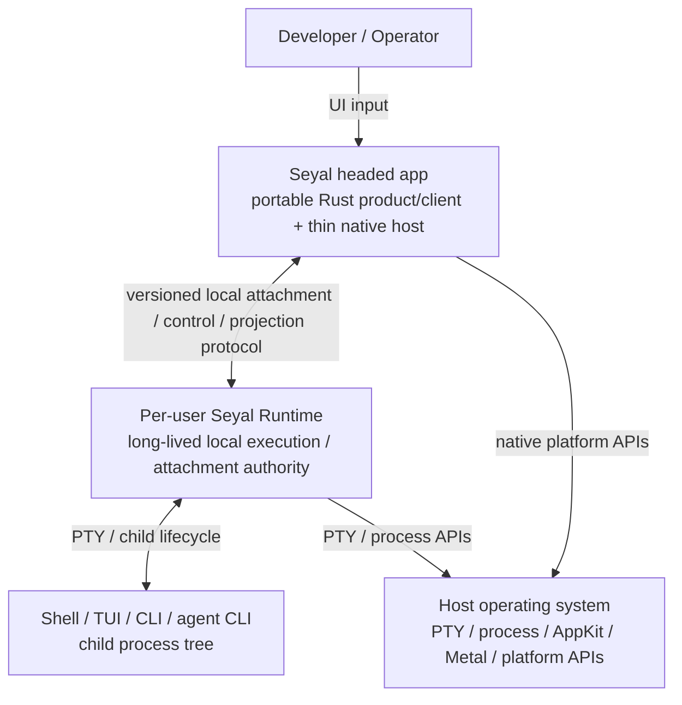

# C4 Level 2 — Container View

## Purpose

Show the major application/process boundaries. Internal Rust/native components are intentionally deferred to the Level-3 views.



## Seyal headed app

The headed app is a disposable presentation/control client relative to the long-lived Runtime.

It contains the portable Rust product/client layer, derived render preparation and the thin platform host. Those internal components are shown in [`04-product-ui-components.md`](04-product-ui-components.md).

The app must not become the owner of a second PTY, VT engine or canonical terminal state.

## Per-user Runtime

The Runtime is a separate long-lived local authority whose lifetime is not defined by one GUI window/process.

It owns or composes:

- the TerminalExecution registry;
- attachment/controller/observer authority;
- bounded multi-execution orchestration;
- projection production;
- currently assigned Workspace/Block metadata composition.

Its internal terminal/runtime component ownership is shown in [`03-terminal-runtime-components.md`](03-terminal-runtime-components.md).

Closing the GUI is not equivalent to terminating executions.

## Child process tree

The shell/application runs under a real PTY. SSH, tmux, editors, TUIs, CLIs and agent CLIs remain normal terminal workloads unless a separate supported integration is explicitly defined.

The child process tree is not part of Seyal's application container; Seyal owns the PTY/process lifecycle around it.

## Two different boundaries

Do not conflate these:

```text
headed app ↔ Runtime
  versioned local attachment/control/projection protocol

portable Rust ↔ native macOS code inside headed app
  coarse typed native bridge/actions/snapshots
```

They serve different purposes and have different ownership constraints.

## Persistence boundary

The Runtime may outlive the GUI so executions can continue and be reattached. Durable history/workspace persistence and live-PTY survival across Runtime crash/reboot are distinct problems and must not be conflated.
