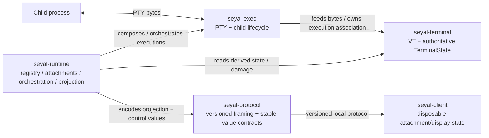

# C4 Level 3 — Terminal/Runtime Components

## Purpose

Show the core Rust ownership boundaries without turning library dependency structure into a fake runtime pipeline.



The arrows show ownership/dependency/interaction relationships. They do not imply that `seyal-protocol` or `seyal-runtime` becomes terminal-state authority.

## `seyal-exec`

Owns:

- terminal endpoint / PTY descriptors;
- child process lifecycle;
- `TerminalExecution` execution-side ownership;
- platform readiness composition required by accepted architecture.

It does not own GUI/rendering or Runtime registry policy.

## `seyal-terminal`

Owns the single canonical terminal-semantics engine:

```text
PTY byte stream
→ incremental VT parser/state machine
→ authoritative TerminalState
→ grid / alternate screen / retained-history semantics
→ damage
```

Unicode/grapheme/width and retained-history behavior extend this same authority according to their accepted ADRs/specifications.

No client, renderer or native host may maintain a competing authoritative VT/grid/state model.

## `seyal-runtime`

Owns:

- per-user execution registry;
- attachment/controller authority;
- bounded multi-execution orchestration;
- display projection production;
- current Workspace/BlockTimeline composition where assigned by accepted architecture.

Runtime composes the execution but does not move terminal semantic authority out of `seyal-terminal`.

## `seyal-protocol`

Owns versioned framing and stable wire/projection value contracts.

It must not expose Rust memory layout, pointers, mutable canonical grid state, renderer/GPU objects or native framework types as wire authority.

## Hot-path invariant

Canonical progress remains conceptually:

```text
PTY bytes
→ seyal-terminal VT/state mutation
→ damage
→ derived projection/render preparation
```

It must never synchronously depend on agents, semantic extraction, persistence, cloud or telemetry.

## State ownership summary

```text
PTY / child lifecycle        seyal-exec
VT / canonical terminal      seyal-terminal
Runtime execution registry   seyal-runtime
wire/projection schema       seyal-protocol
derived render preparation   seyal-render
client display cache/UI      seyal-client
native AppKit/Metal surface  macOS host
```

When code appears to need two authoritative owners for one row, stop and resolve the ownership conflict through the accepted architecture/specification process.
