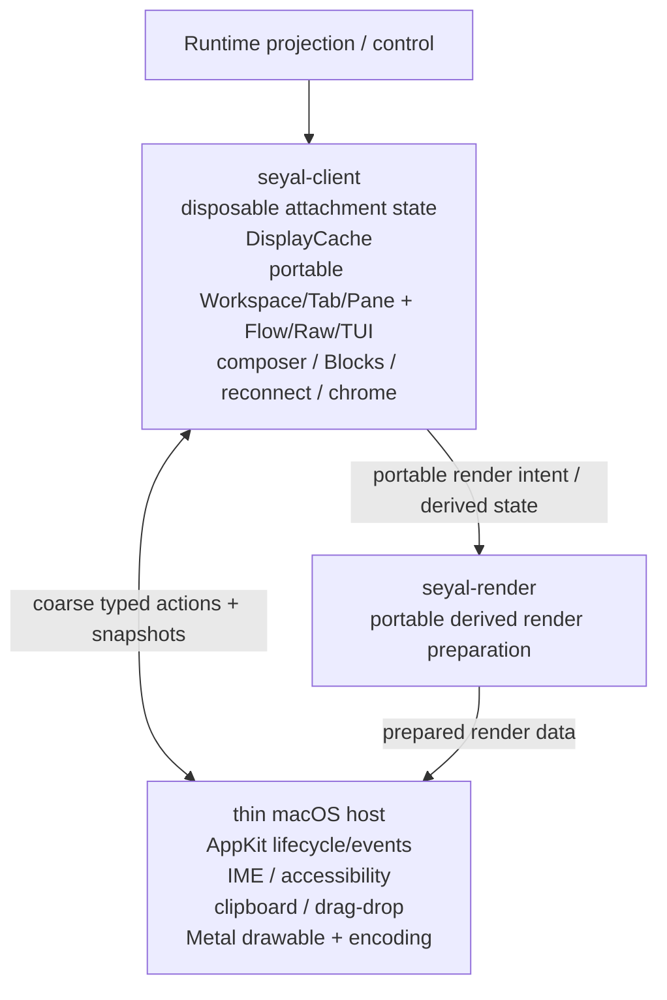
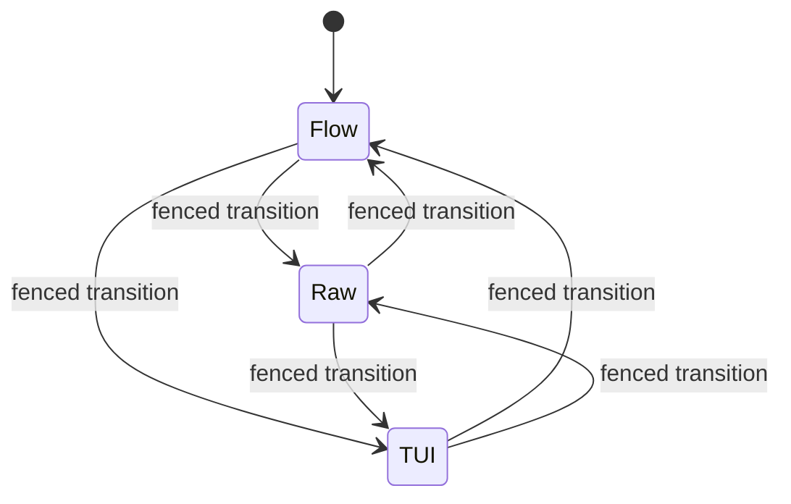

# C4 Level 3 — Product/UI Components

## Purpose

Show how headed product behavior, derived rendering and the native macOS host fit together without creating a second terminal authority.

## Rust product/UI authority

Portable product state and behavior belong in Rust according to ADR-015. This includes Workspace/Tab/Pane composition, command Blocks, composer behavior, focus/layout policy, presentation mode state and other portable product logic.

The native host realizes coarse Rust snapshots/actions through platform APIs. It must not reconstruct a parallel product-state tree.

## `seyal-client`

`seyal-client` owns the disposable headed/client-side projection and portable product reducer. Its terminal display cache is derived and rebuildable.

It must not:

- become canonical VT/TerminalState authority;
- replay PTY bytes through another VT engine;
- gain a production dependency on `seyal-runtime` that bypasses protocol/attachment boundaries.

## `seyal-render`

Owns portable preparation/normalization of derived render data. It is not canonical terminal state and does not own Metal/AppKit objects.

## Thin macOS host

The macOS host is intentionally narrow. Appropriate ownership includes:

- application/window lifecycle;
- native keyboard/mouse event acquisition;
- IME marked/preedit adapter state;
- accessibility integration;
- native clipboard/drag-drop/platform APIs;
- Metal drawable/surface and GPU command encoding/presentation;
- other macOS-only realization required by accepted architecture.

Portable product behavior is not added to Swift for convenience.

## Flow / Raw / TUI presentation

One execution has one current presentation authority at a time.

- **Flow:** Rust composer + command Blocks; terminal pixels only inside Block output regions.
- **Raw:** full-pane terminal presentation.
- **TUI:** full-pane terminal-application presentation.

Flow must not coexist with a hidden/raw terminal input viewport for the same execution. Mode transitions fence stale focus/input/IME/mouse routes before the new presentation becomes authoritative.

## Rendering invariant

The renderer consumes derived display state. GPU/native rendering must never mutate or become the source of terminal semantics.

If the GUI disappears, the **Runtime-owned execution continues** and its canonical terminal semantics remain owned by `seyal-terminal` within that execution. Reopening the GUI reconstructs disposable client/render state from current authoritative state.
