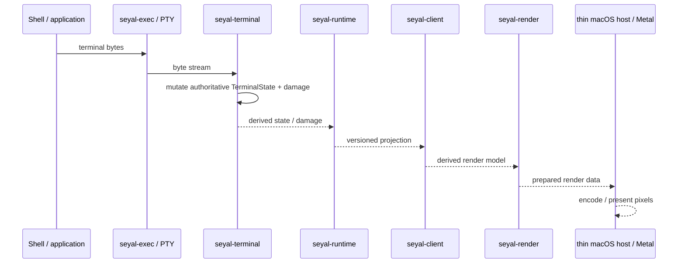
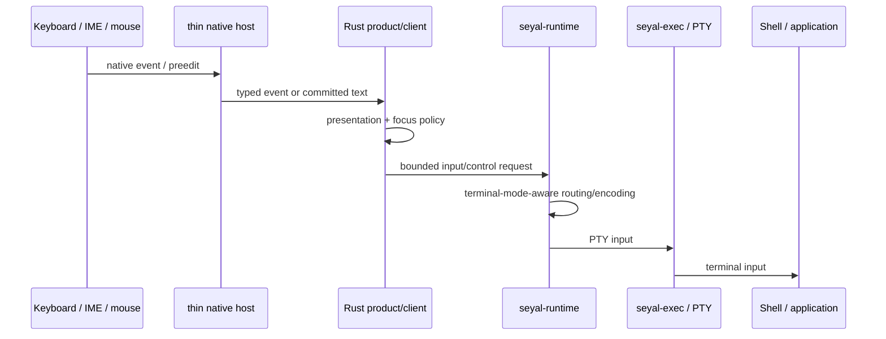
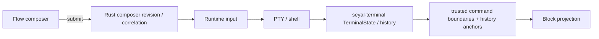
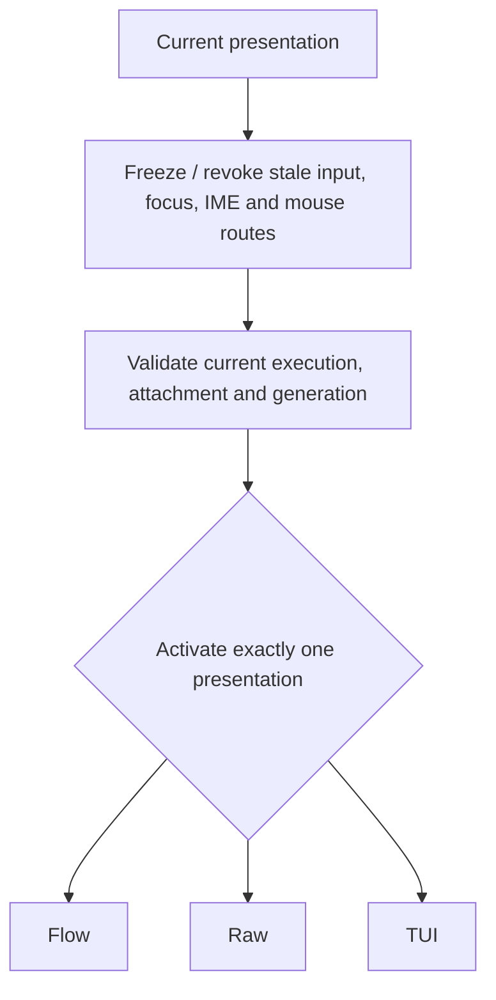
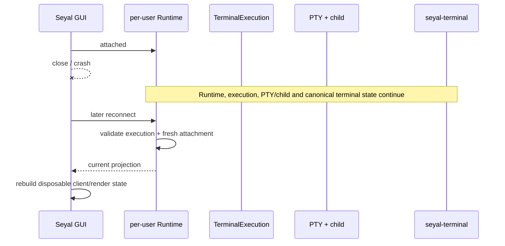

# C4 Dynamic Views — Execution Flows

These views explain important runtime interactions. They are descriptive projections of accepted ADR/spec behavior.

## Output path



No stage after `seyal-terminal` becomes a second terminal authority.

## Input path



Ephemeral native IME preedit state stays native; committed input enters the normal Rust/runtime path.

## Flow command path



A Block represents real terminal execution. It does not create another PTY, VT engine, process or transcript authority.

## Flow ↔ Raw/TUI transition



There is no simultaneous hidden raw-terminal input surface underneath Flow.

## GUI close / reopen



Detach is not terminate.

## Explicit termination

Explicit execution termination is a Runtime/execution lifecycle operation. It must respect ownership, other attached controllers where applicable, child reaping/final drain and resource cleanup. GUI destruction alone must not masquerade as this operation.

## Persistence distinction

```text
GUI survival boundary        Runtime can outlive GUI
Runtime crash boundary       separate problem
live PTY restoration         cannot be recreated by journal/history alone
reboot recovery              separate problem
history/workspace durability separate persistence problem
```

Do not claim that persisted terminal text or event journals restore a live PTY/process.

## Hot-path isolation

Agents, semantic extraction, persistence, cloud and telemetry may be additive systems, but none may become a synchronous dependency of PTY → VT → terminal-state → render progress.
